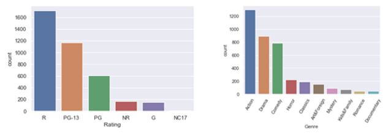
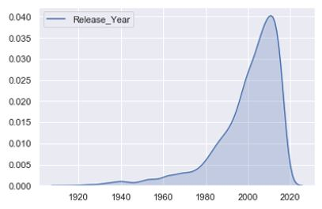
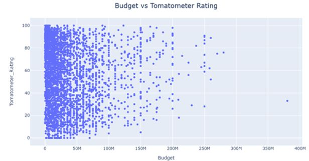
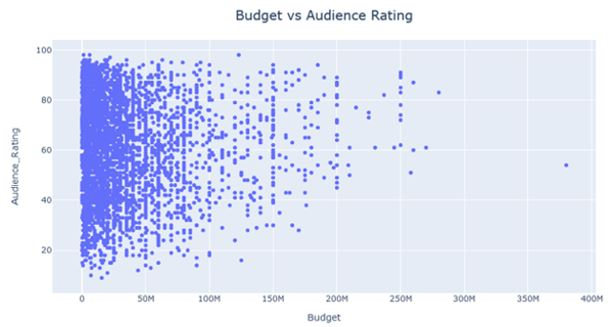
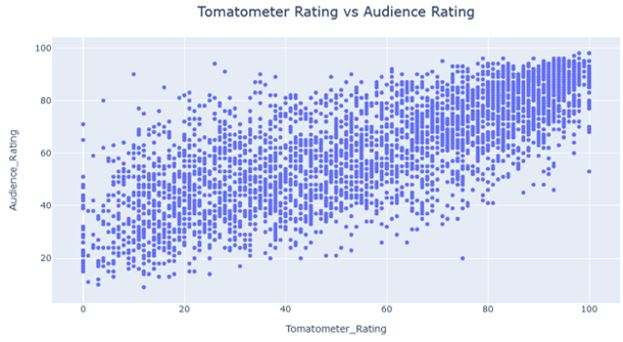
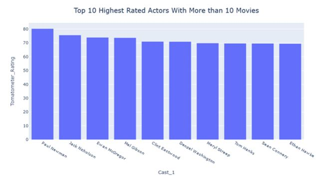
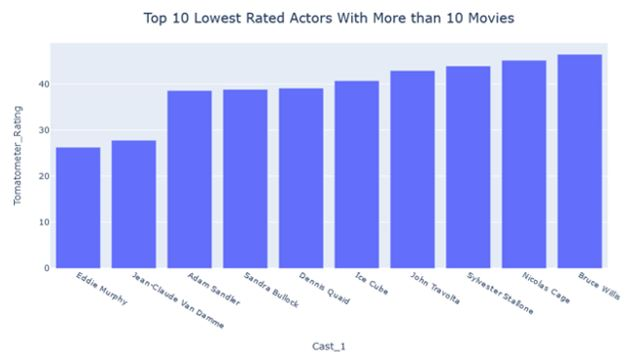

<!-- HEADER -->

  <h1 align="center">Tomatometer Predictions:</h1>
  

     Predicting Tomatometer Scores with Movie Attributes

## Table of Contents
* [Overview](#overview)
* [Data](#data)
* [EDA](#EDA)
* [Methods](#methods)

 ## Overview
This research is an attempt to help film studios in deciding which movies to green-light by using a tool that will predict the quality of a potential movie.  This tool will attempt to predict Tomatometer Rating and Tomatometer Status by using movie characteristics which would be known prior to a movie production starting.

## Data
 The final [dataset](datasets/movie_dataset.csv) used for this research was made by compiling together pieces of two different datasets found on Kaggle – [one](datasets/all_movie.csv) made from data scraped from Rottentomatoes.com and the [other](datasets/movie_metadata.csv) made from the Full MovieLens dataset.  
 
 Exclusions: All movies with a ‘Tomatometer Count’ of less than 100, meaning there are less than 100 ratings from critics for each of these movies, were excluded.  The purpose of this exclusion was to make sure that movies with very few reviews will not be counted towards the research.  Also, all movies with a null ‘Budget’ were excluded.  This reduced the count of movies in the final dataset to ~3,800 movies. 

 This final dataset will be used to research the predictability of Tomatometer Scores (ranging from 0 to 100) and Tomatometer Statuses (Certified Fresh, Fresh, and Rotten) for movies before production has begun.  This will be attempted through both Natural Language Processing and Machine Learning regression models.

 ## EDA
 The majority of the movies in the final dataset have a Rating of either ‘R’ or ‘PG-13’ and also fall into the Genre of ‘Action’, ‘Drama’, or ‘Comedy’.

  

 
 Most of the movies in the final dataset were created recently.  Using more recent data like this should help with identifying up-to-date trends in the data.

  

Other EDA was performed to see if ‘Budget’ is an obvious predictor of either Tomatometer Rating (ratings from the critics or Audience Rating (ratings from average viewers).  However, there appears to not be much correlation:

  
  

As would probably be expected, a strong correlation between ‘Tomatometer Rating’ and ‘Audience Rating’ can be seen:

  

When deciding whether to green-light a project, film studios consider who the leading actor/actress of the movie is.  While the ‘Cast’ data was ultimately not used in the predictive models because of very high cardinality, it is still interesting to view a breakdown of the highest and lowest rated actors/actresses in the dataset:

  
  

## Methods
All methods can be seen in the [Predicting Tomatometer Scores](./Predicting_Tomatometer_Scores.ipynb) notebook.

#### Method #1:

Using both numerical and categorical columns in the dataset, predict Tomatometer Rating (# between 0 and 100) and Tomatometer Status (Certified-Fresh, Fresh, or Rotten) with Random Forest Regressor (RFR) model.

Mean Absolute Error used for scoring Tomatometer Rating predictions.

Accuracy Score used for scoring Tomatometer Status predictions.

Preprocessing data:

One Hot Encoding applied to the categorical columns used in the model (Rating and Genre), which were selected based off their low cardinality.  MinMaxScaler applied to the numerical columns (Runtime, Release Month, and Budget).

Results:

Random Forest Regressor model proved to be relatively successful in predicting the Tomatometer Rating, producing a Mean Absolute Error of ~21.  This means that while only being provided with the ‘Genre’, ‘Rating’, ‘Runtime’, ‘Release Month’, and ‘Budget’, a film studio could probably guess within about 21 points what the Tomatometer Rating of a proposed movie would be.

RFR model was able to predict which Tomatometer Status a movie would fall into with a 43% accuracy 

  

#### Method #2:

Using the Description (or plot) column in the dataset, predict Tomatometer Tomatometer Status with different Natural Language Processing techniques.

Logistic Regression models created using different vectorizer techniques: TF-IDF Vectorizer, Count Vectorizer, and Hashing Vectorizer.

Also a Long Short-Term Memory model was created.

Preprocessing data:

One Hot Encoding applied to Tomatometer Status column.  Also, the only movies included were those with a Description length of greater than 300 words.  This resulted in a [dataset](datasets/movie_dataset_desc.csv) of ~2,300 movies, with most of the movie descriptions being roughly 500 to 1,000 words in length.

Results:

Logistic Regression models had similar results for each type of Vectorizer.  TF-IDF Vectorizer scored the highest of the 3 models with a 47% accuracy.  However, the other two Vectorizer models had similar results, with Count Vectorizer scoring 44% and Hashing Vectorizer scoring 46%.

  

All 3 models also had about the same Precision score, which is the ratio of correctly predicted positive observations to the total predicted positive observations.  However, the Recall score, which is the ratio of correctly predicted positive observations to the all observations in actual class, was considerably higher for the TF-IDF Vectorizer compared to the other two.  This caused the F1 Score, which is the weighted average of Precision and Recall, to be highest for TF-IDF.

  

Long Short-Term Memory, which was using Accuracy as a scoring metric, performed similarly to the 3 Vectorized Logistic Regression models, coming in at 47% accurate.  The LSTM model also took considerably more time to run, with 5 epochs and each epoch taking about 4 minutes to run.

## Conclusions

When trying to predict the Tomatometer Rating of a movie, the Random Forest Regressor model proved to be surprisingly successful.  Being able to predict a Tomatometer Score within 21 percentage points (MAE) knowing only the Genre, Rating, Runtime, Release Month and Budget could be helpful information to film studios.

When trying to predict the Tomatometer Status of a movie, all methods attempted had similar results, with accuracy scores ranging from 43% to 47%.

